# Refactor refresh_data to Python (unit-testable, cron-runnable)

Plan: refactor `scripts/cron/refresh_data.sh` into a Python-based, unit-testable pipeline and **orchestrator** that manages the full cross-instance rollout. Incorporates [BLUE_GREEN_INSTANCE_ROLLOUT.md](BLUE_GREEN_INSTANCE_ROLLOUT.md) **Final design** (Option 1: two instances, DB per instance, traffic switch via DNS or static IP, turn off unused instance).

## Goals

- **Unit-testable**: Config, checkpoint, step order, skip logic, smoke thresholds, instance lifecycle, traffic switch, and cron setup are pure or mockable; steps execute via an abstract runner.
- **Cron-runnable**: One cron job runs the full cycle on the active instance (or both instances have cron and the script no-ops when run on inactive). Env loaded before Python (e.g. `set -a && source .env && set +a`).
- **Full cross-instance cycle**: From bringing up a sleeping instance through refreshing data there and flipping traffic (static IP or DNS) from old prod to the refreshed instance, to scheduling cron on the newly active instance and suspending the inactive instance. No manual steps in the happy path.
- **Behavior preserved**: One pipeline (pre-built vs bazel fallback, checkpoint/resume, all ingest/post-process/smoke steps). Where it runs is the runner (LocalRunner = this host; RemoteRunner(host) = that host via SSH). We use one database per instance; there is no DB swap step.
## Clean design (system-design view)

**Problem:** “Run refresh on inactive instance” is conflating (a) *what* to run (the pipeline) with (b) *where* to run it (this host vs that host). That leads to “two modes” and “single DB vs two DB” special cases.

**Standard approach: one pipeline, pluggable execution backend.**

- **Pipeline** = one DAG of steps (drop indexes → ingest → post-process → recreate indexes → VACUUM → warm cache → smoke). The pipeline code only calls `runner.run_bin(...)`, `runner.run_psql(...)`; it does not care *where* those run.
- **Runner** = execution backend. **LocalRunner**: run commands on this host (subprocess). **RemoteRunner(host)**: run commands on `host` (e.g. SSH + subprocess there). **MockRunner**: record calls for tests. Same pipeline, different runner—no “local mode” vs “remote mode” in the pipeline.
- **Orchestrator** = higher-level workflow: resolve active/inactive → start inactive → wait healthy → **run the same pipeline with RemoteRunner(inactive_host)** → smoke (via runner) → traffic switch → safety → stop old → (optional) cron on new active. “Run refresh on inactive” = `run_pipeline(config, RemoteRunner(inactive_host), resume=False)`.

**Config:** Each instance has a single database (`visa_bulletin`). No DB swap step; pipeline ends after smoke.

**Industry solutions we are not using (but could):** **Temporal**, **Prefect**, **Airflow** model this as a workflow with activities (StartInstance, RunRefresh, SwitchTraffic, …). We get the same separation with a minimal custom implementation: one pipeline DAG, one runner interface, one orchestrator that composes instance lifecycle + pipeline run. If we later need retries, observability, or multi-step scheduling, we could replace the custom orchestrator with Temporal/Prefect.

## End-to-end cycle (orchestrator)

When running the **orchestrator** (full cross-instance rollout per BLUE_GREEN_INSTANCE_ROLLOUT.md):

1. **Resolve active vs inactive** – DNS or static IP → which instance is active, which is inactive. If this host is inactive, exit (no-op).
2. **Start inactive instance** – Lightsail API: if stopped, StartInstance; wait until `running`.
3. **Wait for inactive healthy** – SSH reachable + app health (e.g. `curl -f http://<inactive-ip>/`). Timeout 5–10 min. Abort on failure.
4. **Run data refresh on inactive** – Run the **same pipeline** with **RemoteRunner(inactive_host)**. Pipeline steps (drop indexes, ingest, post-process, …) execute on the inactive host via the runner; checkpoint/resume work there. No separate “local refresh binary” invoked over SSH; the orchestrator calls `run_pipeline(config, RemoteRunner(inactive_ip), resume)`.
5. **Smoke tests on inactive** – Via runner (or HTTP to inactive); abort if any fail.
6. **Traffic switch** – DNS (Namecheap getHosts/setHosts) or static IP (Lightsail detach/attach). Refreshed instance becomes active.
7. **Safety interval** – Sleep (e.g. 30 min). Optionally re-check health of new active.
8. **Stop old instance** – Lightsail API stop. Saves cost.
9. **Cron on newly active** – Either cron on both (script no-ops when run on inactive) or SSH to new active and run cron setup.

Single entry point (e.g. `refresh_and_switch.py`) runs steps 1–9. All automated.

## Architecture

- **One pipeline** – Ordered steps; each step uses only `runner.run_*`. Runs the same whether the runner is LocalRunner (this host) or RemoteRunner(inactive_host). One DB per instance; no swap step.
- **One orchestrator** – Resolve active/inactive → start inactive → wait healthy → run pipeline with RemoteRunner(inactive) → smoke → traffic switch → safety → stop old → (optional) cron. Uses the same pipeline; the runner is the only difference.
- **Entry points** – **(1)** Cron on active runs `refresh_and_switch.py` (orchestrator). **(2)** For single-host / legacy: cron runs `refresh_data.py` which runs the pipeline with LocalRunner (no instance lifecycle, no traffic switch).

```mermaid
flowchart LR
  subgraph entry [Entry]
    Wrapper[refresh_data.sh or refresh_and_switch.sh]
    Main[refresh_data.py or refresh_and_switch.py]
  end
  subgraph orchestrator [Orchestrator]
    Resolve[resolve active/inactive]
    Start[start inactive]
    WaitHealthy[wait healthy]
    RunPipelineRemote[run_pipeline with RemoteRunner]
    Smoke[smoke]
    TrafficSwitch[traffic switch]
    Safety[safety interval]
    StopOld[stop old instance]
    CronSetup[cron on new active]
  end
  subgraph pipeline [Pipeline same everywhere]
    Steps[Step functions]
    RunPipeline[run_pipeline config runner context]
  end
  subgraph runner [Runner backend]
    LocalRunner[LocalRunner this host]
    RemoteRunner[RemoteRunner SSH to host]
    MockRunner[MockRunner tests]
  end
  Wrapper --> Main
  Main --> Resolve
  Resolve --> Start
  Start --> WaitHealthy
  WaitHealthy --> RunPipelineRemote
  RunPipelineRemote --> RunPipeline
  RunPipeline --> Steps
  Steps --> runner
  RunPipelineRemote --> Smoke
  Smoke --> TrafficSwitch
  TrafficSwitch --> Safety
  Safety --> StopOld
  StopOld --> CronSetup
```



- **Entry**: Orchestrator: `refresh_and_switch.py` (cron on active). Local-only: `refresh_data.py [--resume]` (pipeline with LocalRunner; no instance lifecycle).
- **Config**: Paths, .env, DB name. Orchestrator: instance names, IPs, DNS, API credentials.
- **Checkpoint**: Read/write JSON; `should_skip_step(resume_from, step)` pure. Used by the pipeline wherever it runs (local or remote); checkpoint file lives on the host where the pipeline runs.
- **Runner**: **LocalRunner** – `run_bin`, `run_psql`, `run_sudo_psql`, `run_migrate`, … (subprocess on this host). **RemoteRunner(host)** – same interface, executes via SSH on `host`. **Orchestrator** – `start_instance`, `stop_instance`, `wait_instance_healthy`, `switch_traffic_to_instance`, `setup_cron_on_host` (Lightsail/Namecheap/SSH). **MockRunner** – records calls for tests.
- **Pipeline**: One definition. Ordered steps; for each step, call step function `(config, runner, context)`; step uses only `runner.run_*`. Same code path for local and remote; only the runner implementation changes.

## Project layout

- **scripts/cron/refresh_data.py** – CLI: load config, setup logging, **run pipeline with LocalRunner** (`--resume` supported). Used when cron runs on a single host (no cross-instance). ~150–200 lines.
- **scripts/cron/refresh_and_switch.py** – CLI: load config, **run orchestrator** (resolve active/inactive → start inactive → wait healthy → **run pipeline with RemoteRunner(inactive_host)** → smoke → traffic switch → safety → stop old → cron). Same pipeline; only the runner is RemoteRunner(inactive).
- **scripts/cron/refresh/** – Core logic; **no `__init__.py`**; package defined by **scripts/cron/refresh/BUILD** only:
  - **config.py** – `RefreshConfig` (paths, .env, DB name), `load_config(project_root)`, `get_env_value` / `update_env_value`.
  - **checkpoint.py** – `STEPS_ORDER`, `CheckpointData`, `read_checkpoint`, `write_checkpoint` (atomic), `should_skip_step(resume_from, step)`.
  - **runner.py** – **Runner** protocol: `run_bin`, `run_psql`, `run_sudo_psql`, `run_migrate`, `update_env`, `check_disk_space`, `restart_docker`. **LocalRunner** (subprocess on this host). **RemoteRunner(host)** (SSH to host, run same commands there). **OrchestratorRunner** (or separate): `start_instance`, `stop_instance`, `wait_instance_healthy`, `switch_traffic_to_instance`, `setup_cron_on_host`. **MockRunner** (records calls).
  - **steps.py** – One function per step; each calls only `runner.run_*`. Steps take `(config, runner, context)`. No DB swap step (one DB per instance).
  - **smoke.py** – `run_smoke_tests(runner, db_name, config)`; uses runner for queries/HTTP; test with MockRunner.
  - **disk.py** – `check_disk_space(threshold_percent)`; implementation uses subprocess or runner.
  - **discovery.py** – `check_new_sources(runner)`; uses runner to run check-completeness; test with mock output.
  - **pipeline.py** – `run_pipeline(config, runner, resume: bool) -> int`. One implementation. Loop over `STEPS_ORDER`; skip when `should_skip_step`; else run step (runner), write checkpoint. Discovery once at start. Return 0 on success.
  - **instance.py** – Resolve active/inactive (DNS or static IP); start/stop/state (Lightsail API). Pure logic + runner for I/O.
  - **traffic_switch.py** – DNS (Namecheap getHosts/setHosts) or static IP (Lightsail detach/attach). Protocol/runner for tests.
  - **orchestrate.py** – `run_orchestrate(config, runner, safety_interval_sec) -> int`. Steps 1–9; step 4 = `run_pipeline(config, RemoteRunner(inactive_host), resume)`.

Step order (one pipeline, same everywhere): ensure_db, index_snapshot_saved, ingest_complete, backfill_*, cluster_job_titles, indexes_restored, update_employer_stats, cluster_employers, update_job_title_cluster_stats, populate_job_title_slugs, vacuum_analyze, start_services, warm_cache, smoke_tests. No swap step. 
## Cron and wrapper

- **Cross-instance (orchestrator):** Cron runs on the **active** instance (or on both instances with script no-op when run on inactive). Wrapper invokes `refresh_and_switch.py` (or `refresh_data.py --mode=orchestrate`). Same env setup: `set -a && source .env && set +a`. Cron entry: `0 2 * * 0 cd /opt/visa_bulletin && bash scripts/cron/refresh_data.sh >> ... 2>&1` (or a dedicated `refresh_and_switch.sh` that runs the orchestrator). After traffic switch, the **newly active** instance must have cron: either **(a)** both instances have the same crontab so no "schedule cron on new active" step, or **(b)** after flip, orchestrator SSHs to new active and runs `setup-ingest-cron.sh` there.
- **Local-only (single host):** Thin wrapper `refresh_data.sh`: `set -e; cd "$(dirname "$0")/../.."; set -a; [ -f .env ] && source .env; set +a; export BUILD_WORKSPACE_DIRECTORY="$(pwd)"; exec python3 scripts/cron/refresh_data.py "$@"`. Used when SSHing to the inactive instance to run refresh there (or when not yet using cross-instance rollout). No change to `deployment/cron/setup-ingest-cron.sh` for local-only.

Recommend **Option A** for local wrapper so existing cron entries keep pointing at `scripts/cron/refresh_data.sh`; when moving to cross-instance, switch cron to run the orchestrator entry point.

## Key implementation details

- **run_bin**: Same semantics as bash: if `bazel-bin/$target` is executable, run it with env (DB_*, etc.) inherited; else `bazel run //path:name -- $args`. Project root from config; required binaries list same as current `scripts/cron/refresh_data.sh` (lines 83–95).
- **.env handling**: Config loader reads `project_root/.env` (key=value lines, no export) and sets `os.environ` only for keys not already set (or always override for DB_NAME when switching). Matches current "get_env_value + export" behavior. Wrapper still sources .env so cron doesn't depend on Python parsing.
- **Checkpoint path**: `config.backup_dir / "refresh_checkpoint.json"`. Atomic write: write to `.tmp` then rename.
- **Logging**: Python script sets up logging to stdout; when run from cron, wrapper or cron redirect appends to log file. Optionally in Python: open log file and tee (current script uses `exec > >(tee -a "$LOG_FILE")`); can be done with a logging handler that writes to both file and sys.stdout.
- **Root check**: In main, if `os.geteuid() == 0`, log error and exit 1 (same as bash).
- **No DB swap step**: Each instance has one database; pipeline ends after smoke. Traffic switch is at the instance level (DNS or static IP), not DB swap.
- **Orchestrator – instance lifecycle**: Lightsail API (or `aws lightsail` CLI): `get_instance_state(instance_name)`, `start_instance(instance_name)`, `stop_instance(instance_name)`. Credentials: IAM user (e.g. `visa-bulletin-deploy`) with Lightsail permissions; on instance, store credentials outside repo (see BLUE_GREEN_INSTANCE_ROLLOUT.md §10). Wait for healthy: poll state until `running`; optional SSH + `curl -f http://<ip>/` with timeout (e.g. 5–10 min).
- **Orchestrator – traffic switch**: **(a) DNS (Namecheap):** getHosts (SLD/TLD) → modify A for `@` and `www` to inactive instance’s static IP → setHosts; preserve MX, TXT, etc. API user/key and whitelisted IP required (BLUE_GREEN_INSTANCE_ROLLOUT.md §9). **(b) Static IP (Lightsail):** detach static IP from old instance, attach to refreshed instance; effectively instant cutover. Instance "rename" is not supported by Lightsail; use static IP reassignment or DNS.
- **Orchestrator – cron on new active**: Either **(a)** both instances have the same crontab (script at start resolves "am I active?" and exits when run on inactive); or **(b)** after traffic switch, SSH to the new active instance and run `setup-ingest-cron.sh` (or equivalent) so the next weekly run is scheduled there.

## Testing strategy

- **Unit tests** (under `tests/`):
  - **checkpoint**: `should_skip_step` for various resume_from and step; read/write checkpoint with temp file.
  - **config**: `load_config` with temp dir and .env file; blue/green inference from DB_NAME; get_env_value / update_env_value with temp .env.
  - **smoke**: `run_smoke_tests` with MockRunner returning fixed PSQL output; assert pass/fail and messages for threshold edge cases.
  - **disk**: `check_disk_space` with mock subprocess or temp /proc-style input.
  - **discovery**: `check_new_sources` with MockRunner returning fixed check-completeness output.
  - **pipeline**: With MockRunner that records calls and returns success, run `run_pipeline(config, mock_runner, resume=False)` and assert order of runner calls and checkpoint writes; with `resume=True` and pre-written checkpoint, assert skipped steps and correct resume_from.
  - **instance**: Resolve active/inactive from mock DNS response or mock Lightsail describe output; start/stop/get state with MockRunner recording API calls.
  - **traffic_switch**: DNS path: getHosts → modify A → setHosts with mock Namecheap client; static IP path: detach/attach with mock Lightsail client. Assert correct IP/instance targeting.
  - **orchestrate**: With MockRunner that records calls (start_instance, run_remote_refresh, switch_traffic_to_instance, stop_instance, setup_cron_on_host), run `run_orchestrate(config, mock_runner, safety_interval_sec=0)` and assert order of steps and no traffic switch on failure (e.g. smoke fails).
- **Integration**: Optional: one test that runs `refresh_data.py --dry-run` if we add a dry-run that runs steps but uses a no-op runner (no real DB/psql). For orchestrator: optional end-to-end test with real SSH/Lightsail/Namecheap in CI (or rely on manual/cron runs).

## BUILD and deps

- **scripts/cron/BUILD**: Add `py_binary(name = "refresh_data_py", srcs = ["refresh_data.py"], deps = ["//scripts/cron/refresh:refresh", "//lib/utils:http_utils", "//django_config:settings", ...])`. Add `py_binary(name = "refresh_and_switch_py", srcs = ["refresh_and_switch.py"], deps = ["//scripts/cron/refresh:refresh", "//scripts/cron/refresh:orchestrate", ...])` for the orchestrator. Keep `sh_binary(name = "refresh_data", srcs = ["refresh_data.sh"], data = [":refresh_data_py", ...])` so `refresh_data.sh` invokes the Python binary (or `python3 scripts/cron/refresh_data.py` when not run via Bazel). Optionally add `sh_binary(name = "refresh_and_switch", ...)` for orchestrator wrapper.
- **scripts/cron/refresh/BUILD**: Define the refresh package here (no `__init__.py` in this directory). Use one or more `py_library` targets for the modules (e.g. `config`, `checkpoint`, `runner`, `steps`, `smoke`, `disk`, `discovery`, `pipeline`, `instance`, `traffic_switch`, `orchestrate`); expose an aggregate or the targets that `refresh_data.py` and `refresh_and_switch.py` need. Follow IWYU: depend on specific targets; optional aggregate like `name = "refresh"` that includes all modules for the binaries' deps.
- **Dependencies**: django_config (settings, logging), lib.utils (http_utils, logging_utils), standard library (subprocess, pathlib, json, argparse, dataclasses). For orchestrator: optional `requests` or Namecheap API client for DNS; `boto3` or `aws lightsail` CLI for Lightsail API; SSH (paramiko or subprocess `ssh`). No Django ORM in pipeline code (only in step that runs migrate via runner).

## Migration path

1. Add `scripts/cron/refresh/` with modules (config.py, checkpoint.py, runner.py, steps.py, smoke.py, disk.py, discovery.py, pipeline.py) and **scripts/cron/refresh/BUILD** (no `__init__.py`); add `refresh_data.py` in scripts/cron/; add tests. Validate local refresh (single-host) first.
2. Replace body of `refresh_data.sh` with thin wrapper that sources .env and runs `python3 scripts/cron/refresh_data.py "$@"`. Point `sh_binary` data at any needed assets (or rely on project root); ensure cron and `deployment/cron/setup-ingest-cron.sh` unchanged for local-only.
3. Add orchestrator modules (instance.py, traffic_switch.py, orchestrate.py) and `refresh_and_switch.py`; extend runner protocol for instance lifecycle, SSH, traffic switch, cron setup. Add unit tests for instance, traffic_switch, orchestrate.
4. (When adopting BLUE_GREEN_INSTANCE_ROLLOUT.md) Configure instance names, static IPs, DNS domain, API credentials; add optional `refresh_and_switch.sh` wrapper; switch cron to run orchestrator on active instance (or install same cron on both instances). Update `scripts/README.md`, deployment docs, and BLUE_GREEN_INSTANCE_ROLLOUT.md to reference the new script.
5. Run one full cycle manually: start inactive → refresh on inactive → smoke → traffic switch → safety → stop old → verify cron on new active. Run one full local refresh manually (and optionally with `--resume` after interrupting) to validate.

## Files to add/change

| Action | File |
| ------ | ---- |
| Add | `scripts/cron/refresh/config.py` |
| Add | `scripts/cron/refresh/checkpoint.py` |
| Add | `scripts/cron/refresh/runner.py` |
| Add | `scripts/cron/refresh/steps.py` |
| Add | `scripts/cron/refresh/smoke.py` |
| Add | `scripts/cron/refresh/disk.py` |
| Add | `scripts/cron/refresh/discovery.py` |
| Add | `scripts/cron/refresh/pipeline.py` |
| Add | `scripts/cron/refresh/instance.py` – instance lifecycle (resolve active/inactive, start/stop/state) |
| Add | `scripts/cron/refresh/traffic_switch.py` – DNS (Namecheap) or static IP (Lightsail) switch |
| Add | `scripts/cron/refresh/orchestrate.py` – run_orchestrate (full cycle steps 1–9) |
| Add | **scripts/cron/refresh/BUILD** – py_library (or per-module targets); no `__init__.py` in refresh/ |
| Add | `scripts/cron/refresh_data.py` – local refresh entry point |
| Add | `scripts/cron/refresh_and_switch.py` – orchestrator entry point (optional wrapper `refresh_and_switch.sh`) |
| Add | Tests (e.g. `tests/test_refresh_config.py`, `tests/test_refresh_checkpoint.py`, `tests/test_refresh_smoke.py`, `tests/test_refresh_instance.py`, `tests/test_refresh_traffic_switch.py`, `tests/test_refresh_orchestrate.py`, etc.) |
| Change | `scripts/cron/refresh_data.sh` – thin wrapper only |
| Change | `scripts/cron/BUILD` – py_binary for refresh_data_py and refresh_and_switch_py, deps on `//scripts/cron/refresh:refresh`, keep sh_binary |
| Change | `scripts/README.md` – document Python entry, --resume, and orchestrator (refresh_and_switch) |
| Change | `BLUE_GREEN_INSTANCE_ROLLOUT.md` / deployment docs – reference new end-to-end script when implemented |

No `__init__.py` in `scripts/cron/refresh/`; package is defined by BUILD only. No change to `deployment/cron/setup-ingest-cron.sh` for local-only; when using orchestrator, cron runs the orchestrator (or both instances have same cron and script no-ops when run on inactive).

## Pre-implementation clarifications (decide before coding)

These are the only open decisions; everything else is specified above.

1. **Checkpoint read/write via Runner**  
   When the pipeline runs with **RemoteRunner(inactive_host)**, the checkpoint must live on the inactive host (so resume works there). Add to the Runner protocol: **`read_checkpoint(path) -> dict | None`** and **`write_checkpoint(path, data)`**. LocalRunner: read/write local file. RemoteRunner: SSH and read/write the file on the remote host (e.g. `cat`/redirect or a small remote command that writes JSON). Pipeline calls these after each step so checkpoint is always on the host where steps execute.

2. **Checkpoint schema (match current bash)**  
   Current script uses: `last_step`, `timestamp`, `inactive_db`, `index_snapshot` (optional; preserved across writes). Keep the same shape: **`last_step`**, **`timestamp`** (ISO UTC), **`inactive_db`** (db name used for the run; kept for backward compatibility), **`index_snapshot`** (path to indexes YAML for resume past `index_snapshot_saved`). Atomic write: write to `path + ".tmp"` then rename.

3. **Config source**  
   **Paths / backup_dir**: Same as bash: `REFRESH_BACKUP_DIR` env if set, else `/var/backups/visa-bulletin`, else `project_root/backups`. **Orchestrator**: Instance names, IPs, DNS domain, API credentials — env vars (e.g. `REFRESH_ACTIVE_INSTANCE`, `REFRESH_INACTIVE_INSTANCE`, `REFRESH_DOMAIN`, `NAMECHEAP_API_USER`, …) or a single YAML under `deployment/` or project root. Decide at start of implementation.

4. **"Am I active?" for cron no-op**  
   When cron runs on both instances, the script must exit on the inactive one. **Inputs**: This host’s identity (e.g. instance name or public IP) and current traffic target (DNS A record or Lightsail static IP attachment). **Config**: e.g. `REFRESH_MY_INSTANCE_NAME` or detect from metadata (Lightsail instance name from metadata service). Resolve active/inactive (instance.py) returns which instance is active; compare to "my" identity and no-op if I’m inactive. Document the exact env vars or detection method in the orchestrator section.

5. **SSH for RemoteRunner**  
   SSH user, key path, port: from config or env (e.g. `REFRESH_SSH_USER=ubuntu`, `REFRESH_SSH_KEY_PATH`, `REFRESH_SSH_PORT=22`). Can match existing deployment SSH (see BLUE_GREEN_INSTANCE_ROLLOUT.md).

## First run (prod → staging, no traffic switch)

**Setup:** Current active = prod (44.209.204.255), inactive = staging (54.196.241.197). Prod initiates data refresh on staging. For the first run, do **not** flip the IP automatically; add traffic switch after first validation.

**Env on prod (orchestrator):**
- `REFRESH_ACTIVE_INSTANCE_NAME` = Lightsail name for prod (e.g. `VisaBulletin2GB`)
- `REFRESH_ACTIVE_INSTANCE_IP` = prod IP (44.209.204.255)
- `REFRESH_INACTIVE_INSTANCE_NAME` = Lightsail name for staging (e.g. `VisaBulletinStaging`)
- `REFRESH_INACTIVE_INSTANCE_IP` = staging IP (54.196.241.197)
- `REFRESH_MY_INSTANCE_NAME` = same as `REFRESH_ACTIVE_INSTANCE_NAME` (so script does not no-op on prod)
- `REFRESH_SSH_USER` = ubuntu (or staging SSH user)
- `REFRESH_SSH_KEY_PATH` = path to key for SSH to staging
- `REFRESH_REMOTE_PROJECT_ROOT` = /opt/visa_bulletin (on staging)
- `REFRESH_REMOTE_DB_NAME` = visa_bulletin (single DB on staging)
- AWS credentials for Lightsail (start/stop instance) if staging is stopped

**Run (first validation, no IP flip):**
```bash
cd /opt/visa_bulletin && set -a && source .env && set +a && \
bazel run //scripts/cron:refresh_and_switch_py -- --no-traffic-switch
```
This: resolves active/inactive, starts staging if stopped, waits healthy, runs the full pipeline on staging via SSH, runs smoke tests. It does **not** switch traffic, safety interval, stop prod, or set up cron on staging.

**After first validation:** Add traffic switch (DNS or static IP) and re-run without `--no-traffic-switch` when ready.

## Apply: First run (prod initiates refresh on staging, no IP flip)

**Prod serving:** Prod currently serves via **Gunicorn** on port 8000 (systemd), not Docker. Running the orchestrator on the host does **not** affect prod serving. Docker is not used for the web app on prod.

**SSH key and AWS:** See `scripts/setup_new_instance.sh` (Step 8b) and `docs/deployment/NEW_INSTANCE_SETUP.md` (“Orchestrator (blue-green refresh) setup”) for REFRESH_SSH_KEY_PATH and AWS credentials on new VMs.

0. **Push code and checkout on prod:**
   - Locally: commit and push the refresh refactor (and setup script changes).
   - On prod: `cd /opt/visa_bulletin && git pull` so the orchestrator code and binaries are available.

1. **Set env on prod** (e.g. in `/opt/visa_bulletin/.env` or export before run):
   - `REFRESH_ACTIVE_INSTANCE_NAME` = prod Lightsail name (e.g. `VisaBulletin2GB`)
   - `REFRESH_ACTIVE_INSTANCE_IP` = prod IP (44.209.204.255)
   - `REFRESH_INACTIVE_INSTANCE_NAME` = staging Lightsail name (e.g. `VisaBulletinStaging`)
   - `REFRESH_INACTIVE_INSTANCE_IP` = staging IP (54.196.241.197)
   - `REFRESH_MY_INSTANCE_NAME` = same as `REFRESH_ACTIVE_INSTANCE_NAME`
   - `REFRESH_SSH_USER` = ubuntu
   - `REFRESH_SSH_KEY_PATH` = path to key for SSH to staging (e.g. `/home/ubuntu/.ssh/lightsail_visa_bulletin`); copy key to prod and chmod 600 (see NEW_INSTANCE_SETUP.md).
   - `REFRESH_REMOTE_PROJECT_ROOT` = /opt/visa_bulletin
   - `REFRESH_REMOTE_DB_NAME` = visa_bulletin
   - AWS credentials (e.g. `AWS_PROFILE=visa-bulletin-deploy` or env vars) for Lightsail start/stop if staging is stopped (see setup_new_instance.sh Step 8b).

2. **On prod (run on host; not inside Docker):** Build binary, then run with `--no-traffic-switch` (no IP flip). The orchestrator needs SSH and AWS CLI; run on the host so those are available.
   ```bash
   ssh prod_2Gb_vm 'cd /opt/visa_bulletin && bazel build //scripts/cron:refresh_and_switch_py && bazel shutdown'
   ssh prod_2Gb_vm 'cd /opt/visa_bulletin && set -a && source .env && set +a && ./bazel-bin/scripts/cron/refresh_and_switch_py --no-traffic-switch'
   ```
   Or run in background and monitor logs:
   ```bash
   ssh prod_2Gb_vm 'cd /opt/visa_bulletin && set -a && source .env && set +a && nohup ./bazel-bin/scripts/cron/refresh_and_switch_py --no-traffic-switch > /tmp/refresh_and_switch.log 2>&1 &'
   ssh prod_2Gb_vm 'tail -f /tmp/refresh_and_switch.log'
   ```

3. **Validate:** After run, check staging site (e.g. http://54.196.241.197/) and DB; then add traffic switch and re-run without `--no-traffic-switch` when ready.
