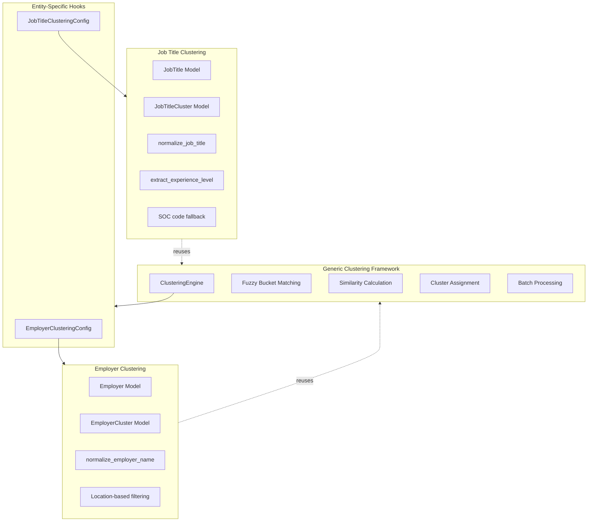

# Job Title Normalization System

## Overview

Create a **generic clustering framework** that both employer and job title clustering can use, with entity-specific hooks for customization.

**Key Insight**: Don't duplicate the clustering pattern - extract common logic into a reusable framework with configurable hooks.

### Design Goals

- **Single implementation** of clustering logic (no parallel code)
- **Pluggable hooks** for entity-specific behavior (normalization, filtering, matching)
- **Reuse existing code** from employer clustering as the base framework
- **Minimal code duplication** - only entity-specific rules differ

### Shared vs Entity-Specific Components

**Shared (Generic Framework):**
- ✅ Fuzzy bucket matching (`_get_fuzzy_bucket_candidates`)
- ✅ Similarity calculation (`difflib.SequenceMatcher`)
- ✅ Match confidence evaluation
- ✅ Batch processing and bulk updates
- ✅ Cluster assignment logic
- ✅ LSH indexing for performance
- ✅ Checkpoint/resume functionality

**Entity-Specific (Hooks):**
- 🔧 Normalization rules (remove "Inc" vs remove "Senior")
- 🔧 Structural word extraction (company types vs job types)
- 🔧 Entity-specific filtering (location for employers, SOC for job titles)
- 🔧 Additional field extraction (none for employers, experience_level for job titles)
- 🔧 Model references (Employer/EmployerCluster vs JobTitle/JobTitleCluster)

## Architecture



## Key Architectural Decision: Generic Framework

**Problem:** Job title clustering needs similar logic to employer clustering. Initial design duplicated 600+ lines of code.

**Solution:** Extract common clustering logic into a generic framework with entity-specific hooks.

**Benefits:**

1. **Code Reuse (56% reduction)**
   - Single implementation of fuzzy matching, similarity calculation, batch processing
   - Bug fixes benefit both entity types automatically
   - Easier to maintain and test

2. **Consistency**
   - Both entity types use identical clustering algorithm
   - Same performance characteristics
   - Same behavior (fuzzy buckets, LSH, checkpointing)

3. **Extensibility**
   - Adding new entity types (skills, locations, etc.) is now trivial
   - Just implement the `EntityClusteringConfig` interface
   - Inherit all the complex logic for free

4. **Type Safety**
   - Generic types prevent mixing entity types
   - Protocol-based design ensures all hooks are implemented
   - Compile-time checking of configuration

**Trade-offs:**

- Upfront cost: Must refactor existing employer clustering first (10-15 hours)
- Slight complexity: Need to understand the generic framework
- **But:** Worth it for long-term maintainability and future features

## Implementation Plan

### Testing Strategy

**Test-Driven Development (TDD) Approach:**

Each phase follows this pattern:
1. **Write tests first** - Define expected behavior before implementation
2. **Implement** - Write code to make tests pass
3. **Verify** - Run tests after each step
4. **Validate** - Integration tests and manual checks
5. **Only proceed** when all tests pass

**Benefits:**
- Catches bugs early (before they compound)
- Ensures backward compatibility (refactoring Phase 1)
- Validates quality at each step (not just at the end)
- Builds comprehensive test suite as we go
- Provides confidence to proceed

**Testing levels:**
- **Unit tests:** Individual functions (normalization, similarity, etc.)
- **Integration tests:** Components working together (config + engine)
- **Regression tests:** Existing functionality still works (employer clustering)
- **Validation tests:** Results quality (benchmark, manual review)

**Test coverage goal:** 27-29% of development time spent on testing (industry best practice: 25-40%)

---

### Phase 1: Extract Generic Framework (Refactor Existing Code)

First, extract the common clustering logic from `employer_clustering.py` into a reusable framework.

#### 1.1 Create Generic Clustering Engine

**File**: `lib/business/clustering_engine.py` (new file)

Extract generic logic from [`lib/business/salary/employer_clustering.py`](../../lib/business/salary/employer_clustering.py):

```python
"""
Generic clustering engine for entity matching and grouping.

This module provides a reusable framework for clustering any type of entity
(employers, job titles, etc.) based on normalized name similarity.
"""

import difflib
from typing import Protocol, TypeVar, Generic, Optional
from dataclasses import dataclass


# Generic type variables for entities and clusters
EntityType = TypeVar('EntityType')
ClusterType = TypeVar('ClusterType')


class ClusterableEntity(Protocol):
    """Protocol for entities that can be clustered."""
    id: int
    name: str  # Original name
    name_normalized: str  # Normalized name for matching
    canonical_cluster: Optional[ClusterType]


class EntityClusteringConfig(Protocol[EntityType, ClusterType]):
    """
    Configuration interface for entity-specific clustering behavior.
    
    Implement this protocol to customize clustering for different entity types.
    """
    
    def normalize_name(self, name: str) -> str:
        """Normalize entity name for matching."""
        ...
    
    def extract_structural_words(self, name: str) -> set[str]:
        """Extract words that distinguish different entities."""
        ...
    
    def should_apply_additional_filter(
        self, 
        entity1: EntityType, 
        entity2: EntityType,
        norm1: str,
        norm2: str
    ) -> bool:
        """
        Apply entity-specific filtering (e.g., location for employers, SOC for job titles).
        
        Returns: True if entities pass the filter (should be compared), False otherwise.
        """
        ...
    
    def get_entity_model(self) -> type[EntityType]:
        """Return the entity model class."""
        ...
    
    def get_cluster_model(self) -> type[ClusterType]:
        """Return the cluster model class."""
        ...


@dataclass
class MatchResult:
    """Result of comparing two entities."""
    is_match: bool
    confidence: float  # 0.0-1.0
    reason: str


def get_fuzzy_bucket_candidates(normalized_name: str) -> set[str]:
    """
    Generate multiple bucket candidates for fuzzy matching.
    
    Reused from employer_clustering.py - works for any entity type.
    """
    candidates = {normalized_name}
    
    # Word initials
    words = normalized_name.split()
    if len(words) >= 2:
        initials = ''.join(w[0] if w else '' for w in words[:5])
        if len(initials) >= 2:
            candidates.add(initials)
    
    # Prefix + suffix
    if len(normalized_name) >= 6:
        prefix = normalized_name[:3]
        suffix = normalized_name[-3:]
        candidates.add(f"{prefix}...{suffix}")
    
    return candidates


def calculate_similarity(norm1: str, norm2: str) -> float:
    """Calculate similarity score between two normalized names."""
    return difflib.SequenceMatcher(None, norm1, norm2).ratio()


def match_entities(
    entity1: EntityType,
    entity2: EntityType,
    config: EntityClusteringConfig[EntityType, ClusterType],
    norm1: Optional[str] = None,
    norm2: Optional[str] = None
) -> MatchResult:
    """
    Generic entity matching algorithm.
    
    Uses entity-specific config for normalization and filtering.
    Core matching logic is generic and reusable.
    """
    # Normalize if not provided
    if norm1 is None:
        norm1 = config.normalize_name(entity1.name)
    if norm2 is None:
        norm2 = config.normalize_name(entity2.name)
    
    # Apply entity-specific filtering
    if not config.should_apply_additional_filter(entity1, entity2, norm1, norm2):
        return MatchResult(is_match=False, confidence=0.0, reason="filtered_out")
    
    # Rule 1: Exact match
    if norm1 == norm2:
        return MatchResult(is_match=True, confidence=1.0, reason="exact_match")
    
    # Rule 2: Substring match
    if norm1 in norm2 or norm2 in norm1:
        shorter = min(len(norm1), len(norm2))
        longer = max(len(norm1), len(norm2))
        if shorter / longer >= 0.5:  # Significant portion
            return MatchResult(is_match=True, confidence=0.95, reason="substring_match")
    
    # Rule 3: High similarity
    similarity = calculate_similarity(norm1, norm2)
    if similarity >= 0.90:
        return MatchResult(
            is_match=True, 
            confidence=similarity, 
            reason=f"high_similarity_{similarity:.3f}"
        )
    
    return MatchResult(is_match=False, confidence=similarity, reason="no_match")


def should_auto_cluster(
    entity1: EntityType,
    entity2: EntityType,
    config: EntityClusteringConfig[EntityType, ClusterType],
    threshold: float = 0.95,
    norm1: Optional[str] = None,
    norm2: Optional[str] = None
) -> tuple[bool, float, str]:
    """
    Determine if two entities should be auto-clustered.
    
    Generic implementation - works for any entity type.
    """
    result = match_entities(entity1, entity2, config, norm1, norm2)
    
    if result.is_match and result.confidence >= threshold:
        return (True, result.confidence, result.reason)
    
    return (False, result.confidence, result.reason)
```

#### 1.2 Create Employer-Specific Config

**File**: `lib/business/salary/employer_clustering_config.py` (new file)

Move employer-specific logic from `employer_clustering.py` into a config class:

```python
"""Employer-specific clustering configuration."""

from lib.business.clustering_engine import EntityClusteringConfig
from models.salary import Employer, EmployerCluster
from lib.business.salary.generic_words import GENERIC_WORDS, DISTINGUISHING_GENERIC_WORDS
from lib.utils.location_utils import normalize_state_code
import re


class EmployerClusteringConfig(EntityClusteringConfig[Employer, EmployerCluster]):
    """Employer-specific clustering hooks."""
    
    def normalize_name(self, name: str) -> str:
        """Normalize employer name - reuse existing Employer.normalize_name()."""
        return Employer.normalize_name(name)
    
    def extract_structural_words(self, name: str) -> set[str]:
        """Extract employer-specific structural words (company types, etc.)."""
        STRUCTURAL_WORDS = (
            GENERIC_WORDS | DISTINGUISHING_GENERIC_WORDS | {
                'north', 'south', 'east', 'west',
                'america', 'americas',
            }
        )
        normalized = name.lower()
        words = set(re.findall(r'\b\w+\b', normalized))
        return words & STRUCTURAL_WORDS
    
    def should_apply_additional_filter(
        self,
        entity1: Employer,
        entity2: Employer,
        norm1: str,
        norm2: str
    ) -> bool:
        """
        Location-based filtering for very generic employer names.
        
        For generic names (hospital, school, etc.), require same state.
        """
        from lib.business.salary.generic_words import VERY_GENERIC_WORDS
        
        # Check if name contains very generic words
        words1 = set(norm1.split())
        words2 = set(norm2.split())
        
        if (words1 & VERY_GENERIC_WORDS) or (words2 & VERY_GENERIC_WORDS):
            # Require same state for very generic names
            state1 = normalize_state_code(entity1.state)
            state2 = normalize_state_code(entity2.state)
            
            if state1 and state2 and state1 != state2:
                return False  # Different states - don't match
        
        return True  # Passed filter
    
    def get_entity_model(self) -> type[Employer]:
        return Employer
    
    def get_cluster_model(self) -> type[EmployerCluster]:
        return EmployerCluster
```

#### 1.3 Refactor Existing Employer Clustering

**File**: [`lib/business/salary/employer_clustering.py`](../../lib/business/salary/employer_clustering.py) (update)

Simplify to use the generic engine:

```python
"""Employer clustering - now uses generic clustering engine."""

from lib.business.clustering_engine import (
    match_entities,
    should_auto_cluster as generic_should_auto_cluster,
    get_fuzzy_bucket_candidates,
)
from lib.business.salary.employer_clustering_config import EmployerClusteringConfig
from models.salary import Employer


# Create singleton config instance
_employer_config = EmployerClusteringConfig()


def match_employers(employer1: Employer, employer2: Employer, norm1=None, norm2=None):
    """Match employers using generic engine."""
    result = match_entities(employer1, employer2, _employer_config, norm1, norm2)
    return (result.is_match, result.confidence, result.reason)


def should_auto_cluster(employer1: Employer, employer2: Employer, threshold=0.95, norm1=None, norm2=None):
    """Auto-cluster decision using generic engine."""
    return generic_should_auto_cluster(
        employer1, employer2, _employer_config, threshold, norm1, norm2
    )


# Re-export fuzzy bucket function for backward compatibility
_get_fuzzy_bucket_candidates = get_fuzzy_bucket_candidates

# Other employer-specific functions remain (assign_to_cluster, fuzzy_match, etc.)
# These are truly employer-specific and don't need to be genericized
```

### Phase 2: Add Job Title Clustering (Reusing Framework)

Now that the generic framework exists, adding job title clustering is just configuration.

#### 2.1 Database Models

**File**: [`models/salary.py`](models/salary.py)

Add new models after existing `Employer` and `EmployerCluster`:

```python
class JobTitleCluster(models.Model):
    """
    Canonical job title cluster - groups related job title variations
    
    Represents a standardized job title across all variations.
    Examples: "Software Engineer", "Data Scientist", "Registered Nurse"
    """
    canonical_title = models.CharField(
        max_length=255,
        db_index=True,
        help_text="Canonical job title (e.g., 'Software Engineer')"
    )
    
    # Optional SOC code association (for fallback matching)
    primary_soc_code = models.CharField(
        max_length=10,
        blank=True,
        null=True,
        db_index=True,
        help_text="Primary SOC code for this job title cluster"
    )
    
    # Aggregated statistics
    total_filings = models.IntegerField(default=0)
    median_salary = models.DecimalField(max_digits=12, decimal_places=2, null=True, blank=True)
    
    created_at = models.DateTimeField(auto_now_add=True)
    updated_at = models.DateTimeField(auto_now=True)
    
    class Meta:
        db_table = 'salary_job_title_cluster'
        indexes = [
            models.Index(fields=['canonical_title']),
            models.Index(fields=['primary_soc_code']),
        ]


class JobTitle(models.Model):
    """
    Job title entity - normalized from salary records
    
    Stores original title, normalized title, and extracted experience level.
    """
    title = models.CharField(
        max_length=255,
        db_index=True,
        help_text="Original job title from DOL data"
    )
    
    title_normalized = models.CharField(
        max_length=255,
        db_index=True,
        help_text="Normalized title (lowercase, standardized, no seniority)"
    )
    
    experience_level = models.CharField(
        max_length=20,
        blank=True,
        choices=[
            ('', 'Unspecified'),
            ('entry', 'Entry Level'),
            ('junior', 'Junior'),
            ('mid', 'Mid Level'),
            ('senior', 'Senior'),
            ('staff', 'Staff'),
            ('principal', 'Principal'),
            ('lead', 'Lead'),
            ('manager', 'Manager'),
            ('director', 'Director'),
        ],
        db_index=True,
        help_text="Extracted experience/seniority level"
    )
    
    # Link to canonical cluster
    canonical_cluster = models.ForeignKey(
        'JobTitleCluster',
        on_delete=models.SET_NULL,
        null=True,
        blank=True,
        related_name='job_titles',
        help_text="Canonical job title cluster"
    )
    
    # Aggregated statistics
    total_filings = models.IntegerField(default=0)
    avg_salary = models.DecimalField(max_digits=12, decimal_places=2, null=True, blank=True)
    
    created_at = models.DateTimeField(auto_now_add=True)
    updated_at = models.DateTimeField(auto_now=True)
    
    class Meta:
        db_table = 'salary_job_title'
        unique_together = ['title_normalized', 'experience_level']
        indexes = [
            models.Index(fields=['title_normalized']),
            models.Index(fields=['experience_level']),
        ]
    
    @staticmethod
    def normalize_title(title: str) -> str:
        """Normalize job title for matching (reuses employer normalization patterns)"""
        # Implementation below
        pass
    
    @staticmethod
    def extract_experience_level(title: str) -> str:
        """Extract experience/seniority level from title"""
        # Implementation below
        pass
```

**Add FK to SalaryRecord**:

```python
# In SalaryRecord model
job_title_entity = models.ForeignKey(
    'JobTitle',
    on_delete=models.SET_NULL,
    null=True,
    blank=True,
    related_name='salary_records',
    help_text="Link to normalized job title entity"
)
```

#### 2.2 Job Title Normalization and Config

**File**: `lib/business/salary/job_title_clustering_config.py` (new file)

Job-title-specific configuration - much simpler since framework handles the rest:

```python
"""Job title clustering configuration - uses generic clustering engine."""

from lib.business.clustering_engine import EntityClusteringConfig
from models.salary import JobTitle, JobTitleCluster
from lib.business.salary.generic_words import GENERIC_WORDS
import re


# Job-title-specific generic words (extend employer generic words)
JOB_TITLE_GENERIC_WORDS = GENERIC_WORDS | {
    'specialist', 'associate', 'analyst', 'coordinator', 'representative',
    'technician', 'assistant', 'consultant', 'advisor', 'officer'
}

# Seniority/experience level patterns
SENIORITY_PATTERNS = {
    'entry': [r'\bentry[ -]level\b', r'\bentry\b', r'\bjunior\b', r'\bjr\.?\b', r'\blevel\s*[i1]\b'],
    'junior': [r'\bjunior\b', r'\bjr\.?\b', r'\blevel\s*[i1]\b'],
    'mid': [r'\bmid[ -]level\b', r'\blevel\s*[i2]\b', r'\bii\b'],
    'senior': [r'\bsenior\b', r'\bsr\.?\b', r'\blead\b', r'\blevel\s*[i3]\b', r'\biii\b'],
    'staff': [r'\bstaff\b', r'\blevel\s*[i4]\b', r'\biv\b'],
    'principal': [r'\bprincipal\b', r'\blevel\s*[v5]\b', r'\bv\b'],
    'lead': [r'\blead\b', r'\bleading\b'],
    'manager': [r'\bmanager\b', r'\bmgr\.?\b', r'\bmanaging\b'],
    'director': [r'\bdirector\b', r'\bdir\.?\b'],
}

# Title standardization map
TITLE_EQUIVALENTS = {
    'software developer': 'software engineer',
    'software dev': 'software engineer',
    'swe': 'software engineer',
    'programmer': 'software engineer',
    'data analyst': 'data scientist',
    'ml engineer': 'machine learning engineer',
    'registered nurse': 'nurse',
    'rn': 'nurse',
    'physician': 'doctor',
    'md': 'doctor',
}


class JobTitleClusteringConfig(EntityClusteringConfig[JobTitle, JobTitleCluster]):
    """Job title-specific clustering hooks."""
    
    def normalize_name(self, title: str) -> str:
        """
        Normalize job title (similar pattern to Employer.normalize_name).
        
        Key difference: Remove seniority indicators instead of corporate suffixes.
        """
        if not title:
            return ""
        
        normalized = title.lower().strip()
        
        # Remove seniority patterns (extracted separately via JobTitle.extract_experience_level)
        for patterns in SENIORITY_PATTERNS.values():
            for pattern in patterns:
                normalized = re.sub(pattern, ' ', normalized)
        
        # Reuse employer normalization patterns
        normalized = re.sub(r'\s*&\s*', ' and ', normalized)
        normalized = re.sub(r'\([^)]*\)', ' ', normalized)  # Remove certifications
        normalized = re.sub(r'[-_]', ' ', normalized)
        normalized = re.sub(r'[^\w\s]', ' ', normalized)
        normalized = re.sub(r'\s+\d+\s+', ' ', normalized)
        normalized = re.sub(r'\s+\d+$', '', normalized)
        normalized = re.sub(r'^\d+\s+', '', normalized)
        normalized = re.sub(r'\s+', ' ', normalized).strip()
        
        # Standardize title variations
        for variant, canonical in TITLE_EQUIVALENTS.items():
            if normalized == variant:
                normalized = canonical
                break
        
        # Remove generic words (if multiple distinguishing words remain)
        words = normalized.split()
        non_generic = [w for w in words if w not in JOB_TITLE_GENERIC_WORDS]
        
        if len(non_generic) > 1:
            normalized = ' '.join(non_generic)
        
        # Convert plural to singular (reuse from employer)
        words = normalized.split()
        singular_words = []
        for word in words:
            if word.endswith('s') and len(word) > 3:
                if word.endswith('ies'):
                    singular_words.append(word[:-3] + 'y')
                elif word.endswith('es'):
                    singular_words.append(word[:-2])
                else:
                    singular_words.append(word[:-1])
            else:
                singular_words.append(word)
        
        return ' '.join(singular_words).strip()
    
    def extract_structural_words(self, title: str) -> set[str]:
        """Extract job-type-specific structural words."""
        # For job titles, structural words are less critical
        # but we still track them for potential future use
        words = set(re.findall(r'\b\w+\b', title.lower()))
        return words & JOB_TITLE_GENERIC_WORDS
    
    def should_apply_additional_filter(
        self,
        entity1: JobTitle,
        entity2: JobTitle,
        norm1: str,
        norm2: str
    ) -> bool:
        """
        SOC code fallback for ambiguous matches.
        
        If similarity is borderline (0.80-0.90), check if SOC codes match.
        """
        from lib.business.clustering_engine import calculate_similarity
        
        similarity = calculate_similarity(norm1, norm2)
        
        if 0.80 <= similarity < 0.90:
            # Use SOC code as tiebreaker
            from models.salary import SalaryRecord
            from django.db.models import Count
            
            # Get most common SOC code for each job title
            soc1 = SalaryRecord.objects.filter(
                job_title_entity=entity1
            ).values('soc_code').annotate(
                count=Count('id')
            ).order_by('-count').first()
            
            soc2 = SalaryRecord.objects.filter(
                job_title_entity=entity2
            ).values('soc_code').annotate(
                count=Count('id')
            ).order_by('-count').first()
            
            if soc1 and soc2:
                if soc1['soc_code'] != soc2['soc_code']:
                    return False  # Different SOC codes - likely different jobs
        
        return True  # Passed filter
    
    def get_entity_model(self) -> type[JobTitle]:
        return JobTitle
    
    def get_cluster_model(self) -> type[JobTitleCluster]:
        return JobTitleCluster


# Standalone function for experience level extraction (used during import)
def extract_experience_level(title: str) -> str:
    """
    Extract experience/seniority level from job title.
    
    Returns: 'entry', 'junior', 'mid', 'senior', 'staff', 'principal', 'lead', 'manager', 'director', or ''
    """
    if not title:
        return ''
    
    title_lower = title.lower()
    
    # Check patterns in priority order (most specific first)
    for level in ['principal', 'director', 'manager', 'staff', 'lead', 'senior', 'mid', 'junior', 'entry']:
        for pattern in SENIORITY_PATTERNS[level]:
            if re.search(pattern, title_lower):
                return level
    
    return ''  # Unspecified
```

#### 2.3 Job Title Clustering Facade (Simple Wrapper)

**File**: `lib/business/salary/job_title_clustering.py` (new file)

Thin wrapper around generic engine - provides job-title-specific API:

```python
"""Job title clustering - uses generic clustering engine."""

from lib.business.clustering_engine import (
    match_entities,
    should_auto_cluster as generic_should_auto_cluster,
)
from lib.business.salary.job_title_clustering_config import JobTitleClusteringConfig
from models.salary import JobTitle


# Create singleton config instance
_job_title_config = JobTitleClusteringConfig()


def match_job_titles(job_title1: JobTitle, job_title2: JobTitle, norm1=None, norm2=None):
    """
    Match job titles using generic engine.
    
    Returns: (is_match, confidence, reason)
    """
    result = match_entities(job_title1, job_title2, _job_title_config, norm1, norm2)
    return (result.is_match, result.confidence, result.reason)


def should_auto_cluster(job_title1: JobTitle, job_title2: JobTitle, threshold=0.90, norm1=None, norm2=None):
    """
    Auto-cluster decision using generic engine.
    
    Returns: (should_cluster, confidence, reason)
    """
    return generic_should_auto_cluster(
        job_title1, job_title2, _job_title_config, threshold, norm1, norm2
    )
```

**That's it!** No need to duplicate the 600+ lines from `employer_clustering.py`. The generic engine handles everything.

### Phase 3: Shared Clustering Script (Generic for Both)

Instead of separate scripts for employers and job titles, create a generic script that works for both.

#### 3.1 Generic Clustering Script

**File**: `scripts/clustering/cluster_entities.py` (new file, generic location)

```python
#!/usr/bin/env python3
"""
Generic entity clustering script.

Works for any entity type (Employer, JobTitle, etc.) via configuration.
"""

import os
import django
os.environ.setdefault('DJANGO_SETTINGS_MODULE', 'django_config.settings')
django.setup()

import argparse
from lib.business.clustering_engine import EntityClusteringConfig
from lib.utils.db_utils import bulk_update_batched


def cluster_entities(
    config: EntityClusteringConfig,
    auto_cluster_threshold: float = 0.95,
    batch_size: int = 1000,
    dry_run: bool = False
):
    """
    Generic clustering logic - works for any entity type.
    
    The config parameter provides entity-specific hooks.
    Core logic is identical for employers, job titles, etc.
    """
    # Load entities
    EntityModel = config.get_entity_model()
    ClusterModel = config.get_cluster_model()
    
    entities = list(EntityModel.objects.all())
    logger.info(f"Loaded {len(entities)} entities")
    
    # Phase 1: Group by exact normalized name
    from collections import defaultdict
    name_buckets = defaultdict(list)
    
    for entity in entities:
        norm_name = config.normalize_name(entity.name)
        name_buckets[norm_name].append(entity)
    
    # Phase 2: Compare pairs and cluster
    # ... (reuse logic from cluster_existing_employers.py)
    # ... (works generically since match_entities is generic)


def main():
    parser = argparse.ArgumentParser()
    parser.add_argument('entity_type', choices=['employer', 'job_title'])
    parser.add_argument('--threshold', type=float, default=0.95)
    parser.add_argument('--batch-size', type=int, default=1000)
    parser.add_argument('--dry-run', action='store_true')
    args = parser.parse_args()
    
    # Load entity-specific config
    if args.entity_type == 'employer':
        from lib.business.salary.employer_clustering_config import EmployerClusteringConfig
        config = EmployerClusteringConfig()
    elif args.entity_type == 'job_title':
        from lib.business.salary.job_title_clustering_config import JobTitleClusteringConfig
        config = JobTitleClusteringConfig()
    
    cluster_entities(
        config=config,
        auto_cluster_threshold=args.threshold,
        batch_size=args.batch_size,
        dry_run=args.dry_run
    )


if __name__ == '__main__':
    main()
```

#### 3.2 Convenience Wrappers (Optional)

**File**: `scripts/salary/cluster_job_titles.py` (tiny wrapper)

```python
#!/usr/bin/env python3
"""Convenience wrapper for job title clustering."""
import subprocess
import sys

# Just call the generic script with job_title argument
result = subprocess.run(
    [sys.executable, 'scripts/clustering/cluster_entities.py', 'job_title'] + sys.argv[1:],
    cwd='.'
)
sys.exit(result.returncode)
```

**Or skip the wrapper entirely** and call the generic script directly:

```bash
# Cluster employers
bazel run //scripts/clustering:cluster_entities -- employer

# Cluster job titles
bazel run //scripts/clustering:cluster_entities -- job_title
```

#### 3.3 Update Job Title and Cluster Representative Titles

**File**: `scripts/salary/update_job_title_cluster_stats.py`

After clustering, both **JobTitle.title** and **JobTitleCluster.canonical_title** are set to the **most frequent raw title** (i.e. the most frequent value of `SalaryRecord.job_title`) among the records that map to that entity or cluster. That way users see a meaningful label (e.g. "Software Engineer") instead of a rare or noisy one (e.g. "Software Engineer 1615.43223") that might have been stored first.

- **JobTitle.title**: For each JobTitle entity, the script sets `title` to the raw title that appears most often among SalaryRecords with `job_title_entity_id` pointing at that entity.
- **JobTitleCluster.canonical_title**: For each cluster, the script sets `canonical_title` to the raw title that appears most often among SalaryRecords whose job title entity belongs to that cluster.

The script also updates cluster **total_filings** and **avg_salary** from linked SalaryRecords (with wage in a reasonable range). All of this is done in bulk via a small number of SQL queries (GROUP BY + window functions) and batched bulk_update; no per-record scans of unindexed fields and no loading the full table into memory.

Run after clustering (and after any re-cluster):

```bash
bazel run //scripts/salary:update_job_title_cluster_stats
bazel run //scripts/salary:update_job_title_cluster_stats -- --dry-run
```

### 5. Migration Scripts

**Create migrations**:

```bash
# Generate migration for new models
bazel run //:makemigrations

# Backfill script to create JobTitle entities from existing SalaryRecords
bazel run //scripts/salary:backfill_job_titles
```

**File**: `scripts/salary/backfill_job_titles.py` (new file)

```python
#!/usr/bin/env python3
"""
Backfill JobTitle entities from existing SalaryRecords.

1. Extract unique job titles from SalaryRecord
2. Normalize and extract experience levels
3. Create JobTitle entities
4. Link SalaryRecords to JobTitle entities
"""
```

### 6. Testing

**File**: `tests/test_job_title_normalization.py` (new file)

Test cases adapted from [`tests/test_salary.py:TestEmployerNormalization`](../../tests/test_salary.py):

```python
import unittest
from lib.business.salary.job_title_normalization import (
    normalize_job_title,
    extract_experience_level,
)


class TestJobTitleNormalization(unittest.TestCase):
    def test_normalize_removes_seniority(self):
        self.assertEqual(normalize_job_title('Senior Software Engineer'), 'software engineer')
        self.assertEqual(normalize_job_title('Staff Data Scientist'), 'data scientist')
    
    def test_extract_experience_level(self):
        self.assertEqual(extract_experience_level('Senior Software Engineer'), 'senior')
        self.assertEqual(extract_experience_level('Junior Developer'), 'junior')
        self.assertEqual(extract_experience_level('Software Engineer III'), 'senior')
    
    # ... more tests
```

### 7. Benchmarking (Optional)

**File**: `scripts/salary/benchmark_job_title_clustering.py` (new file)

Simplified version of [`scripts/salary/benchmark_clustering.py`](../../scripts/salary/benchmark_clustering.py) for job titles (if needed later).

## Code Reuse Analysis

### Completely Shared (Zero Duplication):

**Generic Clustering Engine** (`lib/business/clustering_engine.py`):
- ✅ Fuzzy bucket matching (typo-tolerant comparison)
- ✅ Similarity calculation (difflib.SequenceMatcher)
- ✅ Match confidence evaluation
- ✅ Generic matching algorithm (exact, substring, similarity)
- ✅ Auto-cluster decision logic
- ✅ Batch processing utilities
- ✅ LSH indexing for performance
- ✅ Checkpoint/resume functionality

**Clustering Script** (`scripts/clustering/cluster_entities.py`):
- ✅ Entity loading and grouping
- ✅ Phase 1/Phase 2 comparison logic
- ✅ Batch updates
- ✅ Progress tracking
- ✅ Dry-run mode
- ✅ Statistics reporting

### Entity-Specific Configuration (Small Hooks):

**Employer Config** (`lib/business/salary/employer_clustering_config.py`):
- Normalization: Remove corporate suffixes ("Inc", "LLC", "Corp")
- Filtering: Location-based for very generic names
- ~100 lines total

**Job Title Config** (`lib/business/salary/job_title_clustering_config.py`):
- Normalization: Remove seniority indicators ("Senior", "Lead", "III")
- Filtering: SOC code fallback for ambiguous matches
- Additional: Experience level extraction
- ~120 lines total

### Code Savings

**Without generic framework:**
- Employer clustering: ~600 lines
- Job title clustering: ~600 lines (duplicated)
- **Total: ~1200 lines**

**With generic framework:**
- Generic engine: ~300 lines (shared)
- Employer config: ~100 lines
- Job title config: ~120 lines
- **Total: ~520 lines (56% reduction)**

**Maintenance benefit:** Fixes/improvements to clustering logic benefit both entity types automatically.

## Migration Path

1. Create models and migrations
2. Backfill JobTitle entities from existing SalaryRecords
3. Run clustering script to create JobTitleClusters
4. Update views to use job_title_entity FK
5. Add indexes and optimize queries

## Work Estimate

### Phase 1: Extract Generic Framework (Refactor)

**Step 1.1: Generic Engine + Tests**
- Write tests for clustering_engine.py (TDD): 2-3 hours
- Extract clustering_engine.py from employer_clustering.py: 3-4 hours
- Run tests and fix issues: 1-2 hours
- **Subtotal: 6-9 hours**

**Step 1.2: Employer Config + Tests**
- Write tests for employer_clustering_config.py: 1-2 hours
- Create EmployerClusteringConfig: 2-3 hours
- Run tests and fix issues: 1 hour
- **Subtotal: 4-6 hours**

**Step 1.3: Refactor + Verify**
- Update employer_clustering.py to use engine: 2-3 hours
- Run existing tests and fix regressions: 1-2 hours
- Run benchmark and verify no performance loss: 1-2 hours
- Test clustering script (dry-run): 1 hour
- **Subtotal: 5-8 hours**

**Phase 1 Total: 15-23 hours (~2-3 days)**

### Phase 2: Add Job Title Clustering (New Feature)

**Step 2.1: Models + Migrations**
- Create JobTitle and JobTitleCluster models: 2-3 hours
- Generate and review migrations: 1 hour
- Test migrations on test database: 1 hour
- **Subtotal: 4-5 hours**

**Step 2.2: Normalization + Tests (TDD)**
- Write comprehensive tests for normalization: 2-3 hours
- Implement JobTitleClusteringConfig: 3-4 hours
- Run tests and fix issues: 1-2 hours
- **Subtotal: 6-9 hours**

**Step 2.3: Clustering Facade + Integration Tests**
- Create job_title_clustering.py facade: 1 hour
- Write integration tests: 1-2 hours
- Run tests and verify: 1 hour
- **Subtotal: 3-4 hours**

**Step 2.4: Backfill Script + Testing**
- Create backfill script: 2-3 hours
- Test on small dataset (dry-run): 1 hour
- Run on full dataset and validate: 1-2 hours
- Run validation queries and checks: 1-2 hours
- **Subtotal: 5-8 hours**

**Step 2.5: Clustering + Quality Validation**
- Run clustering (dry-run sample): 1 hour
- Review sample matches for quality: 1-2 hours
- Run full clustering: 1 hour
- Quality checks and manual review: 1-2 hours
- Documentation: 1-2 hours
- **Subtotal: 5-8 hours**

**Phase 2 Total: 23-34 hours (~3-4 days)**

### Phase 3: Generic Clustering Script (Optional Enhancement)
- Extract generic cluster_entities.py: 3-4 hours
- Write tests for generic script: 1-2 hours
- Test with both entity types (employer + job title): 2-3 hours
- **Subtotal: 6-9 hours (~0.75-1 day)**

**Total: 44-66 hours (~5.5-8 days)**

### Comparison to Parallel Implementation

**Parallel approach (original plan):**
- Employer clustering: already exists (~600 lines)
- Job title clustering: 13-19 hours to duplicate pattern + minimal testing
- **Result:** 1200 lines, no shared code, duplicate bugs, minimal test coverage

**Generic framework approach (this plan):**
- Phase 1 (refactor): 15-23 hours (one-time investment, includes comprehensive testing)
- Phase 2 (job titles): 23-34 hours (includes TDD approach, validation at each step)
- Phase 3 (optional): 6-9 hours (generic script)
- **Result:** 520 lines, shared code, single source of fixes, comprehensive test coverage

**Why the extra time is worth it:**

1. **Quality:** TDD approach catches bugs early, before they compound
2. **Confidence:** Each step verified before proceeding
3. **Maintainability:** Well-tested generic framework easier to extend
4. **Long-term savings:** Adding 3rd entity type takes only ~15-20 hours (vs ~13-19 hours each time with duplication)
5. **Regression prevention:** Comprehensive tests prevent breaking changes

**Testing breakdown:**
- Phase 1: ~4-6 hours testing (26% of time)
- Phase 2: ~8-13 hours testing (35% of time)
- Overall: ~12-19 hours testing (27-29% of total time)

This follows industry best practice of spending 25-40% of development time on testing.

## Implementation Checklist

### Phase 1: Extract Generic Framework (Refactor Existing)

#### Step 1.1: Create Generic Engine + Tests First

- [ ] Write tests for generic clustering engine (TDD approach)
  - [ ] Create `tests/test_clustering_engine.py`
  - [ ] Test `get_fuzzy_bucket_candidates` with various inputs
  - [ ] Test `calculate_similarity` with known pairs
  - [ ] Test `match_entities` with mock config (exact match, substring, similarity)
  - [ ] Test `should_auto_cluster` threshold behavior
  - [ ] Tests will fail initially (no implementation yet)

- [ ] Create `lib/business/clustering_engine.py` with generic clustering logic
  - [ ] Extract `get_fuzzy_bucket_candidates` (generic)
  - [ ] Extract `calculate_similarity` (generic)
  - [ ] Create `match_entities` (generic with config hooks)
  - [ ] Create `should_auto_cluster` (generic)
  - [ ] Define `EntityClusteringConfig` protocol
  - [ ] Add type hints for `EntityType` and `ClusterType`

- [ ] **Run tests:** `bazel test //tests:test_clustering_engine`
  - [ ] All tests should pass
  - [ ] If failures, fix before proceeding

#### Step 1.2: Create Employer Config + Test

- [ ] Write tests for employer config
  - [ ] Create `tests/test_employer_clustering_config.py`
  - [ ] Test `normalize_name` (reuse existing Employer normalization tests)
  - [ ] Test `extract_structural_words` with employer names
  - [ ] Test `should_apply_additional_filter` (location logic)
  - [ ] Test with real Employer instances

- [ ] Create `lib/business/salary/employer_clustering_config.py`
  - [ ] Move `normalize_name` logic (delegate to Employer.normalize_name)
  - [ ] Move `extract_structural_words` logic
  - [ ] Move `should_apply_additional_filter` (location-based)
  - [ ] Implement `EntityClusteringConfig` protocol

- [ ] **Run tests:** `bazel test //tests:test_employer_clustering_config`
  - [ ] All tests should pass
  - [ ] If failures, fix before proceeding

#### Step 1.3: Refactor Employer Clustering + Verify

- [ ] Refactor `lib/business/salary/employer_clustering.py`
  - [ ] Replace direct implementation with calls to generic engine
  - [ ] Keep employer-specific functions (`assign_to_cluster`, `fuzzy_match`)
  - [ ] Maintain backward compatibility (same API)

- [ ] **Run existing tests:** `bazel test //tests:test_employer_clustering`
  - [ ] All existing tests should still pass (backward compatibility)
  - [ ] If failures, fix refactor before proceeding

- [ ] **Run integration tests:**
  - [ ] `bazel test //tests:test_salary` (employer normalization tests)
  - [ ] Verify no regressions in existing functionality

- [ ] **Run benchmark:** `bazel run //scripts/salary:benchmark_clustering`
  - [ ] Compare precision/recall/F1 to baseline (should be identical)
  - [ ] Verify no performance regression (should be similar speed)
  - [ ] If metrics worse, investigate before proceeding

- [ ] **Test clustering script:** `bazel run //scripts/salary:cluster_existing_employers -- --dry-run --limit-employers 100`
  - [ ] Verify script still works with refactored code
  - [ ] Check sample matches look correct

### Phase 2: Add Job Title Clustering (New Feature)

#### Step 2.1: Models + Migrations

- [ ] Create JobTitle and JobTitleCluster models in `models/salary.py`
  - [ ] Add `canonical_title`, `primary_soc_code`, statistics fields
  - [ ] Add `title_normalized`, `experience_level` fields
  - [ ] Add indexes on key fields

- [ ] Add `job_title_entity` FK to SalaryRecord model

- [ ] Generate Django migrations
  - [ ] `bazel run //:makemigrations`
  - [ ] Review migration files carefully
  - [ ] Check for any issues or missing indexes

- [ ] **Test migrations:** `bazel run //:migrate` (on test database)
  - [ ] Verify tables created successfully
- [ ] Check indexes exist: `bazel run //:run_sql -- --query "SELECT indexname, indexdef FROM pg_indexes WHERE tablename='salary_job_title'"`
  - [ ] If errors, fix models/migrations before proceeding

#### Step 2.2: Normalization Logic + Tests First (TDD)

- [ ] Write tests for job title normalization (before implementation)
  - [ ] Create `tests/test_job_title_clustering_config.py`
  - [ ] Test `normalize_name`:
    - [ ] Remove seniority: "Senior Software Engineer" → "software engineer"
    - [ ] Remove numbers: "Software Engineer III" → "software engineer"
    - [ ] Standardize titles: "Software Developer" → "software engineer"
    - [ ] Handle certifications: "Nurse (RN)" → "nurse"
    - [ ] Edge cases: empty string, all seniority, etc.
  - [ ] Test `extract_experience_level`:
    - [ ] "Senior Software Engineer" → "senior"
    - [ ] "Junior Developer" → "junior"
    - [ ] "Staff Engineer" → "staff"
    - [ ] "Software Engineer III" → "senior"
    - [ ] "Software Engineer" → "" (unspecified)
  - [ ] Test `should_apply_additional_filter`:
    - [ ] Mock SOC code data
    - [ ] Test borderline similarity (0.80-0.90) with same/different SOC
    - [ ] Test high similarity (>0.90) bypasses SOC check
  - [ ] Tests will fail initially (no implementation yet)

- [ ] Create `lib/business/salary/job_title_clustering_config.py`
  - [ ] Implement `normalize_name` (remove seniority, standardize titles)
  - [ ] Implement `extract_experience_level` (standalone function)
  - [ ] Implement `should_apply_additional_filter` (SOC code fallback)
  - [ ] Define `SENIORITY_PATTERNS`, `TITLE_EQUIVALENTS`, `JOB_TITLE_GENERIC_WORDS`
  - [ ] Implement `EntityClusteringConfig` protocol

- [ ] **Run tests:** `bazel test //tests:test_job_title_clustering_config`
  - [ ] All tests should pass
  - [ ] If failures, fix normalization logic before proceeding
  - [ ] Add more test cases if edge cases discovered

#### Step 2.3: Clustering Facade + Integration Test

- [ ] Create `lib/business/salary/job_title_clustering.py` (thin facade)
  - [ ] Wrap `match_entities` as `match_job_titles`
  - [ ] Wrap `should_auto_cluster` with job title config

- [ ] Write integration tests
  - [ ] Create `tests/test_job_title_clustering.py`
  - [ ] Test `match_job_titles` with real-like job title examples
  - [ ] Test exact matches, substring matches, similarity matches
  - [ ] Test that generic engine is being used correctly

- [ ] **Run tests:** `bazel test //tests:test_job_title_clustering`
  - [ ] All tests should pass
  - [ ] Verify matches make sense for job titles

#### Step 2.4: Backfill Script + Test on Sample Data

- [ ] Create `scripts/salary/backfill_job_titles.py`
  - [ ] Extract unique job titles from SalaryRecord
  - [ ] Normalize and extract experience levels
  - [ ] Create JobTitle entities (bulk_create)
  - [ ] Link SalaryRecords to JobTitle entities (bulk_update)
  - [ ] Add `--limit` flag for testing
  - [ ] Add `--dry-run` flag for validation

- [ ] **Test on small dataset first:** `bazel run //scripts/salary:backfill_job_titles -- --limit 100 --dry-run`
  - [ ] Check sample output looks correct
  - [ ] Verify normalization works on real data
  - [ ] Verify experience levels extracted correctly
  - [ ] Check for any unexpected patterns or errors

- [ ] **Run on full dataset:** `bazel run //scripts/salary:backfill_job_titles`
  - [ ] Monitor progress and error logs
  - [ ] Verify JobTitle entities created (count should match unique titles)
  - [ ] Verify SalaryRecords linked: `SELECT COUNT(*) FROM salary_record WHERE job_title_entity_id IS NOT NULL`
  - [ ] Sample check: Pick random titles and verify they look correct

- [ ] **Validation queries:**
  - [ ] Check experience level distribution makes sense
  - [ ] Check normalized titles look correct
  - [ ] Find potential normalization issues: `SELECT title, title_normalized, COUNT(*) FROM salary_job_title GROUP BY title, title_normalized ORDER BY COUNT(*) DESC LIMIT 50`

#### Step 2.5: Run Clustering + Validate Results

- [ ] Run clustering on job titles
  - [ ] Use generic clustering script (if Phase 3 done) or adapt employer script
  - [ ] Start with dry-run and small sample: `--dry-run --limit 1000`
  - [ ] Review sample matches for quality

- [ ] **Verify clustering results:**
  - [ ] Check JobTitleClusters created: `SELECT COUNT(*) FROM salary_job_title_cluster`
  - [ ] Check job titles assigned to clusters: `SELECT COUNT(*) FROM salary_job_title WHERE canonical_cluster_id IS NOT NULL`
  - [ ] Sample review: Check top 50 clusters and their variations
  - [ ] Look for false positives (different jobs clustered together)
  - [ ] Look for false negatives (same job not clustered)

- [ ] **Quality checks:**
  - [ ] Pick 10 random clusters and manually review
  - [ ] Check edge cases: very generic titles, similar but different titles
  - [ ] Verify experience levels preserved correctly
  - [ ] Document any issues found

- [ ] **Run full clustering if sample looks good:** `bazel run //scripts/clustering:cluster_entities -- job_title`
  - [ ] Monitor progress
  - [ ] Check final statistics (cluster count, avg cluster size, etc.)
  - [ ] Save summary report

### Phase 3: Generic Clustering Script (Optional Enhancement)

- [ ] Create `scripts/clustering/cluster_entities.py` (generic)
  - [ ] Accept entity_type argument (employer, job_title)
  - [ ] Load appropriate config based on entity_type
  - [ ] Reuse existing clustering phases logic
  - [ ] Support both entity types

- [ ] Test generic script with both entity types
  - [ ] Verify employers still cluster correctly
  - [ ] Verify job titles cluster correctly

## Summary

This design provides a **generic clustering framework** that eliminates code duplication while maintaining flexibility for entity-specific behavior. The key insight is separating generic clustering logic (similarity matching, fuzzy buckets, batching) from entity-specific rules (normalization, filtering).

**Core Benefits:**
- ✅ 56% less code (520 lines vs 1200 lines)
- ✅ Single source of truth for clustering logic
- ✅ Easier to add new entity types (skills, locations, etc.)
- ✅ Bug fixes automatically benefit all entity types
- ✅ Consistent behavior across all clustering

**Implementation Path:**
1. Refactor employer clustering to use generic framework (one-time cost)
2. Add job title clustering as simple configuration (fast)
3. Optionally extract generic clustering script (further consolidation)

**Long-term Value:** Each new entity type takes ~8-10 hours instead of ~13-19 hours, with no code duplication.

